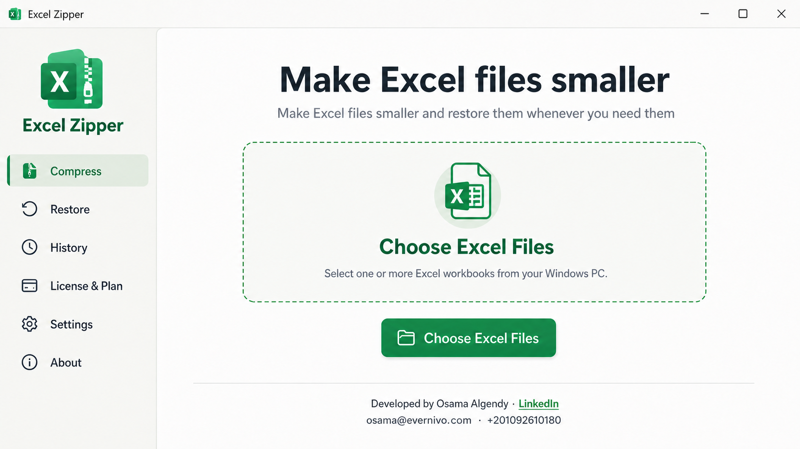
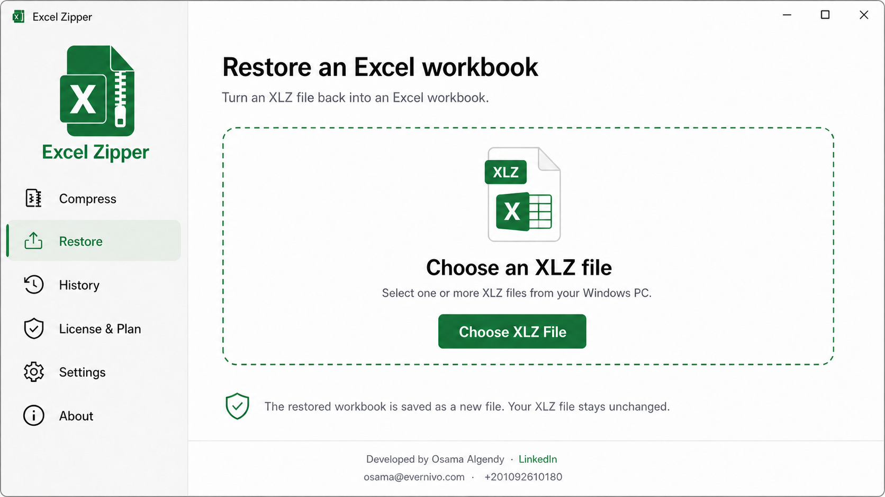
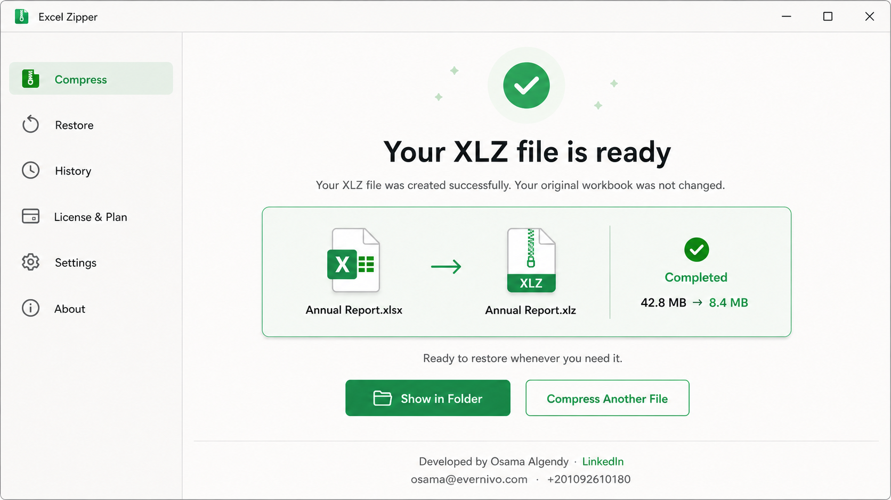

# Sheet Zipper

Sheet Zipper is an Evernivo desktop application for analyzing, optimizing,
archiving, and restoring Excel workbooks locally.

Project page: [Evernivo — Sheet Zipper](https://evernivo.com/excel-zipper/)

## Screenshots

### Compress Excel files

### Restore an Excel workbook

### XLZ archive ready

## Download

Download the current verified Windows installer from
[download.evernivo.com](https://download.evernivo.com/).

Public releases are published only after their installer has been code-signed
and its SHA-256 checksum has been generated. The macOS build is currently an
internal, non-notarized test build and is not distributed here.

## Supported files

- XLSX and XLSM workbooks
- XLSB workbooks for supported analysis and optimization workflows
- Sheet Zipper XLZ files for verified restoration

Workbook processing runs on the local device. Source files are not overwritten.

## Support and security

- Private support: [support@evernivo.com](mailto:support@evernivo.com)
- Privacy: [evernivo.com/privacy](https://evernivo.com/privacy/)
- Security: [SECURITY.md](SECURITY.md)

This repository distributes proprietary release binaries and public product
documentation. It does not contain the Sheet Zipper source code and is not an
open-source software repository.
